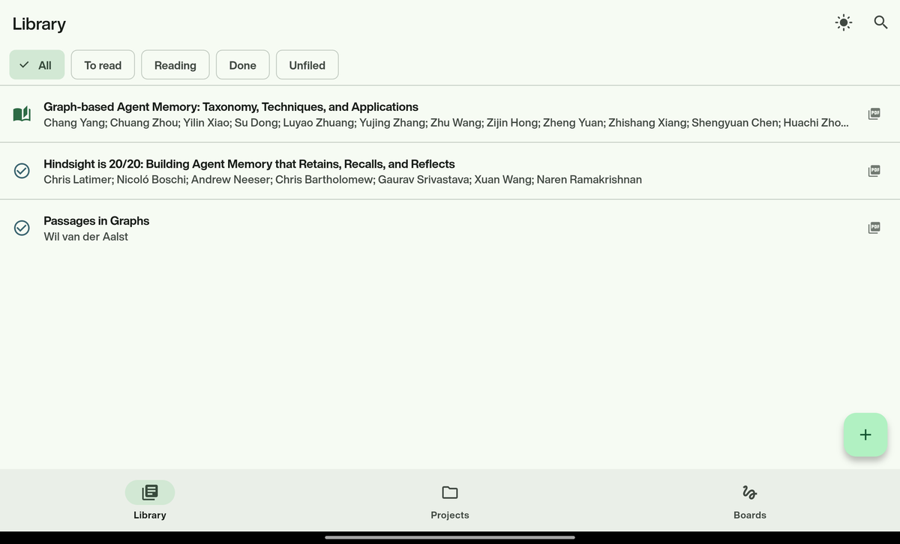
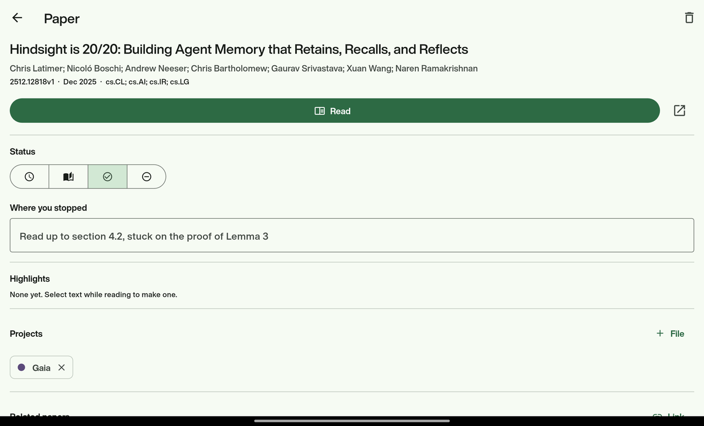
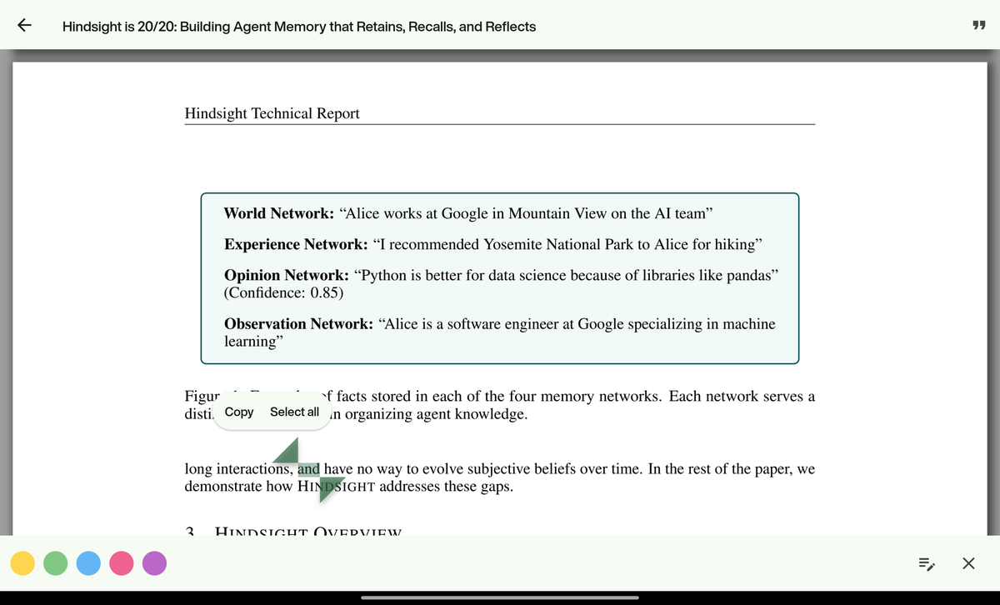
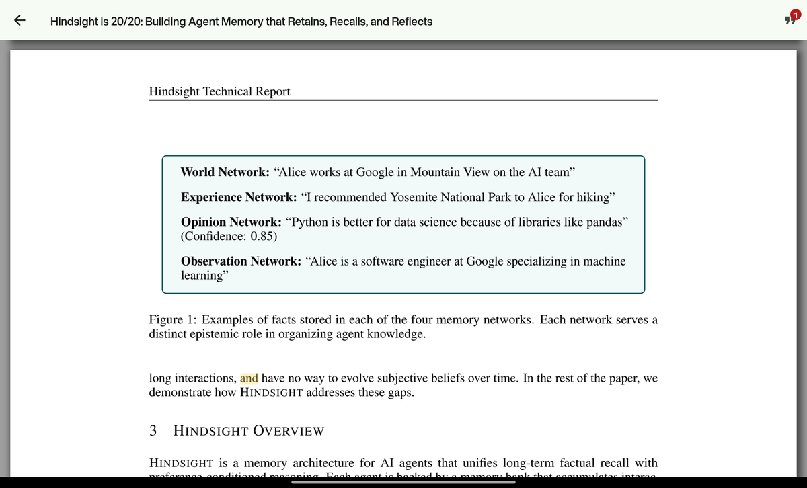
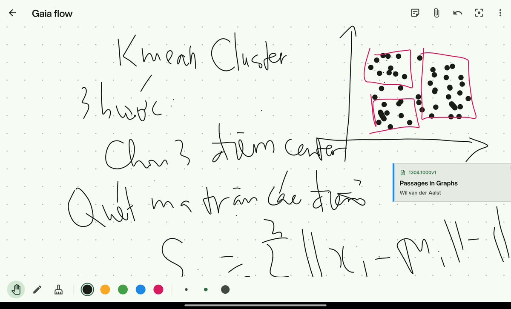

# Papers Cairn

A cairn is a stack of stones marking a trail, so whoever comes next knows where they are on
the path. This app does that for the papers you are reading.

Share an arXiv link from your browser and Cairn fetches the metadata, files the paper under
a project, downloads the PDF, and remembers where you stopped — in prose, not a percentage.

You read the paper inside Cairn and highlight as you go. Those highlights are Cairn's, not
the PDF's: searchable next to your notes, still there after re-downloading the file, and
attached to the paper rather than trapped in whichever reader made them.

Android, built with Flutter. iOS is buildable but untested.

---

## The library

Everything you have, narrowed by where you are with it. *Unfiled* catches papers that
arrived from the share sheet and have not been put anywhere yet.



## A paper

One page for everything you think about a paper: what you were in the middle of, what you
highlighted, which projects it belongs to and why, and which other papers it connects to
and why. Every link carries a reason — a connection you cannot explain is barely worth
recording.



## Reading it

**Read** opens the PDF inside Cairn, on the page you left it. Select any text and the
colours appear along the bottom; the pencil beside them attaches a note to the highlight.



The highlight is stored by Cairn, not written into the PDF — so it turns up in search
alongside your own words, survives deleting and re-downloading the file, and can be exported
later. The counter in the corner tracks how many you have made.



## Boards

A boundless surface for working something out: sketch the argument, draw the arrows, and
pin the actual papers into place among them. Tapping a pinned card opens the paper.



---

## Running it

```bash
flutter pub get
dart run build_runner build     # generates the drift database code
flutter run
```

Generated `*.g.dart` files are not committed, so `build_runner` has to run once after a
fresh clone or the project will not analyze.

```bash
flutter test        # unit tests, no device needed
flutter analyze
```

## Packaging it

```bash
./tool/release.sh              # analyse, test, build → dist/cairn-<version>-<date>.apk
./tool/release.sh --universal  # every CPU architecture, for an older device
```

Install it over USB with `adb install -r dist/<file>.apk`, or copy the APK to the device and
open it from a file manager.

The APK is signed with the **debug key**, deliberately. Signing with a fresh release key
would change the app's signature, and Android refuses to install a differently-signed build
over an existing one — the only way through is to uninstall, which takes every paper,
highlight and board with it. For an app only its author installs, the debug key costs
nothing.

That makes `~/.android/debug.keystore` load-bearing: **lose it and the app can never be
updated again**, only uninstalled and reinstalled empty. It is 2.6 KB. Copy it somewhere
safe.

The app icon comes from `tool/make_icon.py` rather than a checked-in image, so changing it
means editing a few numbers:

```bash
python3 tool/make_icon.py && dart run flutter_launcher_icons
```

## What it does today

- Look a paper up from an arXiv link, id, or citation string, check it is the right one,
  then save it — or share one in from the browser
- Import a paper that is not on arXiv by sharing its PDF into Cairn from a file manager
- One library list, narrowed by reading status or by what is still unfiled
- Group papers into projects, recording why each one belongs there
- Link papers to each other, recording why they are connected
- Track reading status and a free-text note on where you stopped
- Download the PDF and read it in the app, resuming on the page you left
- Highlight text in five colours and attach a note to any highlight
- Search across titles, authors, abstracts, your notes, and your highlights
- Draw on boards: an unbounded surface for sketching how the ideas fit together,
  optionally tied to a project
- Write notes on a board and pin papers from your library onto it, then scribble
  between them

## What it does not do yet

**There is no backup.** Everything lives in the app's private storage on one device; losing
the device or uninstalling the app takes all of it. That is the largest gap here.

Board items cannot be resized, and there are no connector lines between them beyond ones you
draw by hand. Beyond that: no citation graph, no BibTeX or Obsidian export, no sync between
devices, no ink on PDF pages. The iOS share sheet also needs a Share Extension target that
does not exist yet — sharing in works on Android only for now.

## Layout

`lib/core/` is infrastructure: database, arXiv client, file storage, routing. `lib/features/`
holds one directory per feature, each with a `data/` repository and a `presentation/` layer.
Widgets never touch SQLite or HTTP directly; they go through a repository.

[docs/ARCHITECTURE.md](docs/ARCHITECTURE.md) explains the design, which layers of Clean
Architecture were deliberately left out and why, and the platform traps already found the
hard way.
